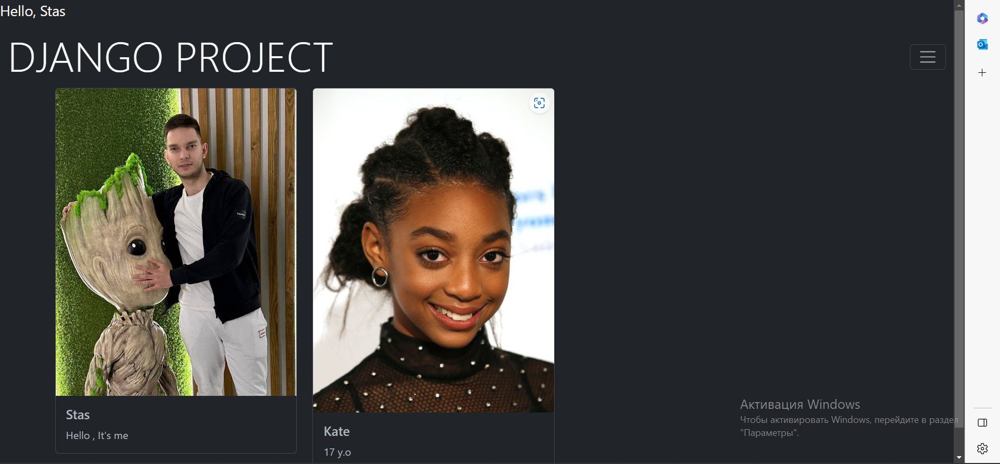
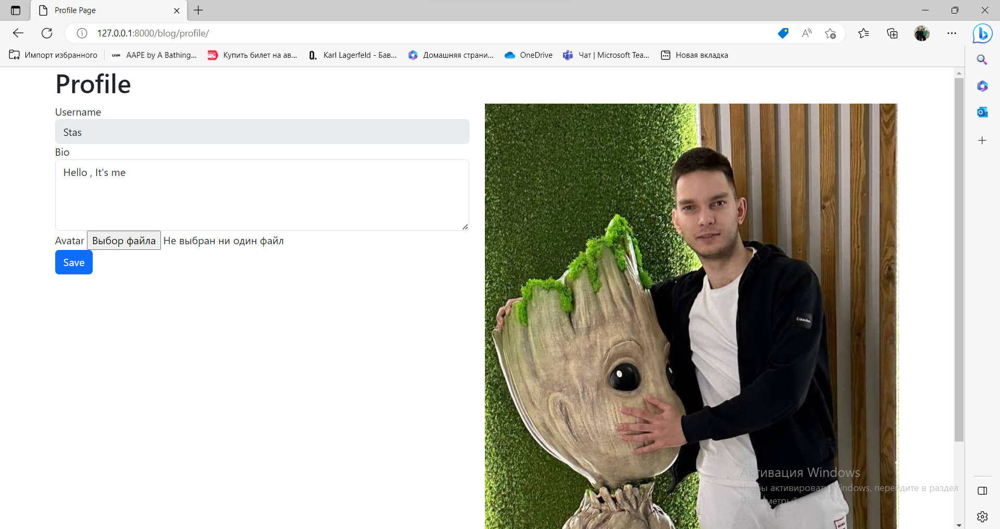
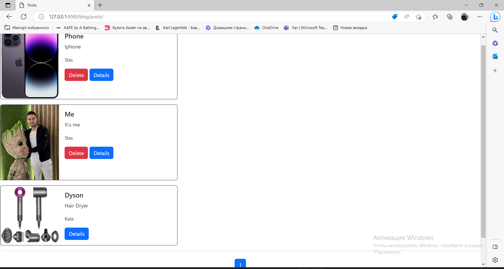

# Blog_Hillel

###### This my blog that use such instrumnets:

--------

Python

Django

SQLite

Celery/ Redis

Bootstrap

HTML/ CSS

--------

- [x] LogIn Page look:

- [x] The Main Page that shows our users:

- [x] You can change your bio or avatar in your profile

- [x] Example of Post where users can comment or add posts

# Enjoy It!